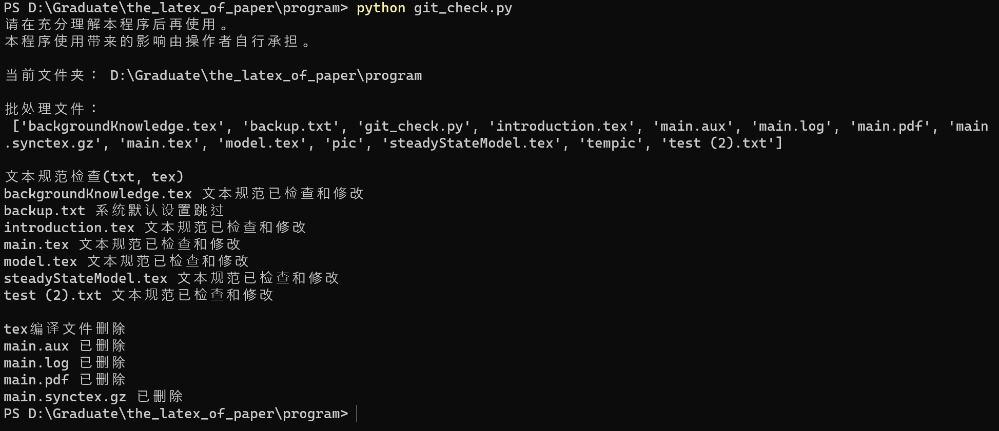

# the_latex_of_paper 提交commit前删掉pdf和日志文件。
## Kiriri Wanted
- [ ] 将`odefish`修改的相关文件同步到`the_latex_of_paper`文件夹内。
- [ ] 完成封面适配。
- [ ] 完成论文引用的`bib-GB`适配。
- [ ] 论文眉线bug 黑色显示问题。
- [ ] 2月末代码排版优化。
## 2024年02月17日 `Kiriri`
- [x] https://github.com/shucreater/the-latex-of-paper/issues/1 数学论文的格式规范检查   初步实现相关功能。

运行实例图：

> [!CAUTION]
> 请在充分理解本程序后再使用。本程序使用带来的影响由操作者自行承担。

## 2024年2月3日 `Kiriri`
1. 调整文件夹结构，第一次提交的文件调整到`latexTemplate`。
2. 添加`CUMCMThesis`文件夹作为`word2latex`参考。